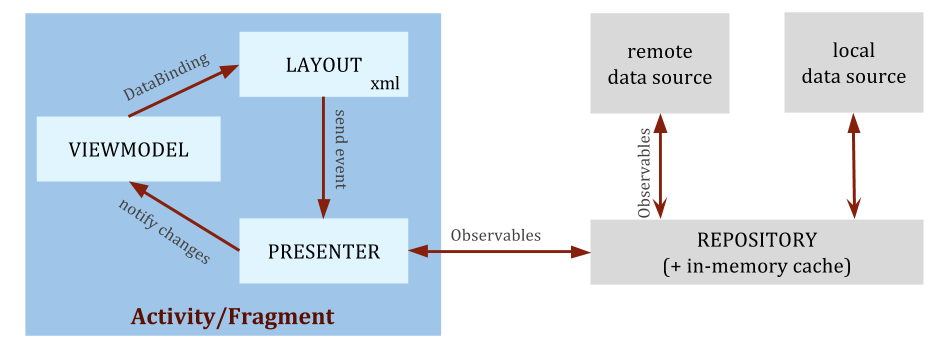

# Architecture guidelines

---- 
# Introduction


The architecture of my projects is mixed of [MVP](https://en.wikipedia.org/wiki/Model%E2%80%93view%E2%80%93presenter) (Model-View-Presenter) and [MVVM](https://en.wikipedia.org/wiki/Model%E2%80%93view%E2%80%93viewmodel) (Model-View-ViewModel) pattern. It is super inspired by [Android Architecture Blueprints](https://github.com/googlesamples/android-architecture) - powered by Google and community. The architecture doesn't follow a strict MVVM or a pattern, as it uses both View Models and Presenters.

With the architecture, it is mixed of the [todo-mvp-databinding](https://github.com/googlesamples/android-architecture/tree/todo-databinding), [todo-mvp-dagger](https://github.com/googlesamples/android-architecture/tree/todo-mvp-dagger), [todo-mvp-rxjava](https://github.com/googlesamples/android-architecture/tree/dev-todo-mvp-rxjava). Consider to see these repos before continuing to read.


# Key Concepts
## Dagger2


[Dagger2](http://google.github.io/dagger/) is a fully static, compile-time dependency injection framework for both Java and Android. It is an adaptation of an earlier version created by Square and now maintained by Google.

Dependency injection frameworks take charge of object creation. For example, in project we create the TasksPresenter in [TasksActivity](https://github.com/googlesamples/android-architecture/blob/todo-mvp/todoapp/app/src/main/java/com/example/android/architecture/blueprints/todoapp/tasks/TasksActivity.java#L75):

```java
mTasksPresenter = new TasksPresenter(
        Injection.provideTasksRepository(getApplicationContext()), tasksFragment);
```

But in this sample, the presenter is injected. Dagger2 takes care of creation and figuring out the dependencies:

```java
public class TasksActivity extends AppCompatActivity {
    @Inject TasksPresenter mTasksPresenter;
    ...
}
```

## Data Binding


The [Data Binding](https://developer.android.com/topic/libraries/data-binding/index.html) saves on boilerplate code allowing UI elements to be bound to a property in a data model.

  * Layout files are used to bind data to UI elements
  * Events are also bound with an action handler
  * Data can be observed and set up to be updated automatically when 
needed


# Implementation
## Architecture preview



Note: in a MVP context, the term "view" is overloaded:

  * The class android.view.View will be referred to as "Android View"
  * The view that receives commands from a presenter in MVP, will be simply called
"view".

## Implementation

## Feature components

There are multiple ways to create the relevant parts of a feature using the
Data Binding Library. In this case, the responsibility of each component in
this sample is:

  * Activity/Fragment: handles views, interaction with framework components (options menu, Snackbar, FAB,
Adapter for list…)
  * Presenter: receives user actions and retrieves the data from the repository. If
it doesn't do data loading, it's calling an action handler.
  * ViewModel: Exposes data for a particular view

Some features don't have a ViewMode as they use the model directly.

## Dependencies

  * Common Android support libraries (<code>com.android.support.\*)</code>
  * Dagger2
  * The Data Binding Framework
  * Android Testing Support Library (Espresso, AndroidJUnitRunner…)
  * Mockito


# Features

## Complexity - understandability

### Use of architectural frameworks/libraries/tools: 

None 

### Conceptual complexity 

NA

### Testability

#### Unit testing

High, presenters are unit tested as well as repositories and data sources.

#### UI testing

High, injection of fake modules allow for testing with fake data

## Code metrics

High class and methods amount

## Maintainability

### Ease of amending or adding a feature

High. 

### Learning cost

  * The Data Binding library takes care of the communication between some components, so developers need to understand what it does and doesn't before making changes to the code.
  * Developers need to be aware of how Dagger2 works, although the setup of new features should look very similar to existing ones.

